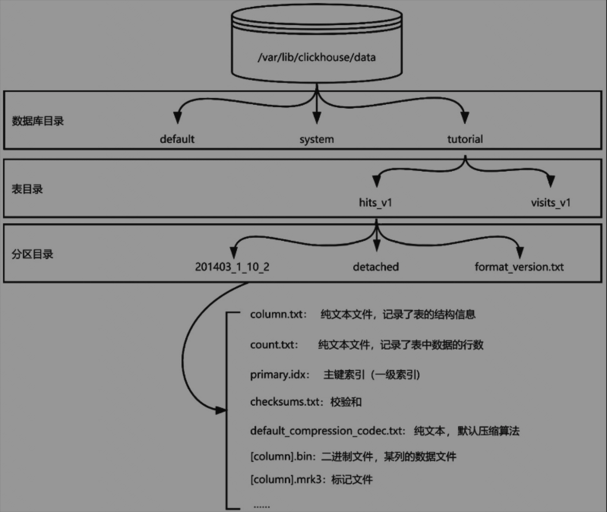
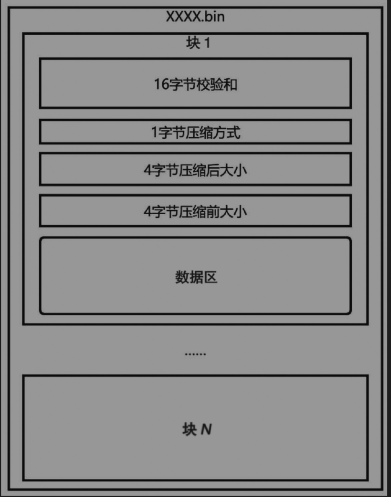

# 第四章 MergeTree 存储引擎架构
**储引擎和计算引擎协同设计**：
在ClickHouse之前，绝大多数大数据技术都是将存储引擎和计算引擎独立设计的。例如MapReduce计算引擎+HDFS存储引擎、Spark计算引擎+HDFS存储引擎等等。 

ClickHouse通过协同改造存储引擎和计算引擎，实现了两个引擎的精妙配合，最终达到了如今令人惊艳的查询性能，形成了大数据业界独树一帜的“存储为计算服务”设计理念。

## 4.1 MergeTree存储引擎的三大特点
设计理念：存储服务于计算。
- 三级数据组织：数据库、数据表和数据分区。
- 数据不可变：MergeTree中的数据一旦写入，就不能再修改。（避免了数据竞争，提升了高并发能力）
- 密集堆放：内存和文件中的数据都压缩存放

## 4.2 MergeTree的数据组织
### 4.2.1 块
块是CK中数据处理的最小单位（默认8192行，通过 index_granularity 属性设置）。CK充分利用SIMD指令，一次处理8192行数据。

## 4.2.2 数据堆放方式
CK 磁盘上的数据按列聚集，不同列的数据会存储到不同的数据文件中。
- 定长数据：addr(N) = Head + N * size
- 变长数据：一个数组存储数据，另一个数组存储 offset
- 数据压缩：压缩存储数据，充分利用闲置的 CPU 资源，支持 LZ4、LZ4HC、zstd 三种方式，默认 LZ4

## 4.3 MergeTree 的文件组织



### 4.3.1 数据文件、元数据文件、索引文件和其他文件
三种文件：
1. 数据文件（bin）
offset(1) = 0
offset(n) = offset(n-1) + 25 + 压缩后大小(n>=2)



- 校验和：16bits 用于校验数据是否完整
- 压缩方式：LZ4(0x82)、ZSTD(0x90)、Multiple(0x91)、Delta(0x92)
- 压缩后大小：存储在数据区的数据大小。需要依据此数值计算下一个块的偏移量。
- 压缩前大小：数据区存储的数据在压缩前的大小。可以依据此数值计算块中数据的压缩比。
- 数据区：用于存储数据，大小为头信息第18～21个字节表示的大小。

2. 元数据文件
元数据文件的文件名固定为Columns.txt。该文件是一个文本文件，未经任何编码，可以直接被人眼识别。元数据文件中存储表结构、字段数据类型、字段数据长度等元数据信息。

3. 索引文件
元数据文件的文件名固定为Columns.txt。该文件是一个文本文件，未经任何编码，可以直接被人眼识别。元数据文件中存储表结构、字段数据类型、字段数据长度等元数据信息。

4. 其他文件
数据文件、元数据文件、索引文件共同构成了MergeTree数据文件的基础，这3种文件可以响应所有的查询请求。除此之外，还有一些文件用于实现额外的动作。
- checksums.txt：一个二进制文件，存储整个分区数据的校验和。用于快速校验数据是否被篡改。 
- count.txt：文本文件，存储该分区下的行数，可以用文本编辑器打开。在执行select count() from xxx命令时，会直接返回该文件的内容，而不需要遍历数据。
- default_compression_codec.txt：ClickHouse新版本增加的一个文件，该文件是一个文本文件，存储了数据文件中使用的压缩编码器。ClickHouse提供了多种压缩算法供用户选择，默认使用LZ4。

### 4.3.2 分区
分区是按照用户指定方式整合的一个数据的逻辑组合。分区的好处：
- 可以帮助系统快速定位数据所在位置，避免发生遍历。这样的设置可以在一定程度上提高查询性能。
- 多个分区可以进行并发查询，进一步提高查询速度。

在Hive等大数据系统中使用分区可以加速查询，但是在ClickHouse上则不然。
- 首先，由于ClickHouse的索引机制，导致分区带来的收益低于索引带来的收益，且两者带来的查询加速效应并不能叠加。大部分情况下用好ClickHouse的索引机制已经能够获得很好的查询性能。
- 其次，分区的并发效应在ClickHouse上用处不大，由于ClickHouse更倾向于单机完成数据查询，单机查询时磁盘性能已经被少数的几个查询线程占满，因此区别于分布式的Spark等系统，在ClickHouse上的并发带来的加速效应远小于ClickHouse索引的加速效应，分区带来的并发加速效果被大大削弱，在ClickHouse上使用分区并不能获得很好的收益。甚至，过多的分区会导致查询时。

### 4.3.3 数据库和表
ClickHouse中的数据库和表都被组织为文件夹。每个数据库都会在ClickHouse的data目录中创建一个子目录，ClickHouse默认携带default和system两个数据库。
- default: 就是默认数据库
- system: 存储ClickHouse服务器相关信息的数据库，例如连接数、资源占用等。

图4-1是按照官方提供的入门教程导入数据后，数据目录的文件列表。可以看到，在tutorial文件夹中，建立了两个子目录，每个子目录为一张数据表。进入hits_v1目录后又能看到两个子目录和一个文本文件。

## 4.4 索引
### 4.4.1 主键索引
ClickHouse的主键索引记录每个块的首个值，这些数据存储于primary.idx文件。ClickHouse会在数据插入时通过LSM（Log Structured Merge，日志结构）算法保证数据写入磁盘后按照用户定义的顺序排列。通过这种预排序技术，ClickHouse的索引不需要像事务数据库一样通过复杂的B+树实现。

主键索引的本质是存储了每个块中数据的最小值，从而快速定位所需数据所在的块，可以仅通过主键索引确定数据到块的映射关系。

### 4.4.2 标记
主键索引并不能单独实现快速查找目标。原因在于，一级索引只实现了数据到块的映射，但块所在的位置并没有保存在主键索引中，而是保存在了标记文件中。也就是说，标记文件存储了块到文件偏移量的映射。通过索引文件和标记文件，才能共同确定一个数据所在的文件位置。在查询时，首先通过索引确认数据所在的块，然后依据标记确认块所在的物理地址，最后通过物理地址从硬盘上读取数据。索引机制也是ClickHouse查询速度快的一个很重要的因素，其核心逻辑是通过索引降低需要读取的数据量，从而减少磁盘I/O时间，达到加速查询的效果。

## 4.5 与事务数据库存储引擎的对比
ClickHouse存储引擎针对大数据量的查询场景进行了充分的优化，这些优化成为ClickHouse在大数据量下实现快速查询的基础。本节将ClickHouse的存储引擎与事务数据库的存储引擎进行对比，列出5个主要的不同点。

1. 基本单位
ClickHouse存储引擎操作的最小单位是块。块的大小一般在64KB～1MB之间。ClickHouse通过一次性操作整个块以提高I/O效率。事务数据库操作的基本单位是页，大小一般为4KB或8KB。事务数据库将对行的操作记录到内存页中，定期以页为单位写入磁盘，以提高I/O效率。

2. 数据顺序
ClickHouse会对数据按照表结构进行排序并写入存储设备。事务数据库则按照事务的先后顺序写入存储设备。

3. 索引方式
事务数据库默认使用B+树建立稠密索引，将索引进行排序后以实现更快的范围查询。而ClickHouse使用稀疏索引，且数据在写入时已经完成了排序，足以支撑快速的范围查询，因此不需要使用B+树。

4. 控制信息
控制信息是数据文件中辅助实际数据进行存储的控制信息，包括但不限于定界符、校验和、元数据、定位信息等。ClickHouse在整个数据文件中的控制信息比例非常小，以UInt8类型的数据文件为例，一个块约为64KB，对应25位控制信息，控制信息只占所有数据量的0.038%。和PostgreSQL的数据文件相比，8KB的页面对应至少28字节的控制信息，比例约为0.34%。二者相比，至少存在10倍的差距。这种极致的控制信息比例，体现了ClickHouse解决大数据问题的世界观。由于ClickHouse认为在大数据场景中，处理单条数据的意义不大，因此在设计存储格式时，直接抛弃了对单条数据的定位信息，这也导致了在ClickHouse中进行点查是一个非常不明智的决定。而事务数据库则必须应对这种点查操作，因此必须快速、精准地定位到记录位置，这也导致了事务数据库的数据文件中存储了大量的定位信息。

5. 压缩
MergeTree将数据压缩后写入存储设备，而事务数据库则不然。详细分析可以参考4.6.3节的内容。为什么MergeTree存储引擎与事务数据库存储引擎会产生上述区别呢？本质原因在于目的不同，导致两者面对的瓶颈不同。MergeTree应对的是海量数据的分析与计算，实现这个目标的瓶颈在于磁盘I/O，因此需要花费更多的精力在降低磁盘I/O上。而事务数据库应对事务，需要符合ACID特性，因此存储引擎的设计更加倾向于实现事务能力，实现事务的瓶颈在于事务间的协调，而不是磁盘I/O。一般来说，事务数据库通过锁机制和MVCC实现原子性和隔离性，通过WAL机制实现持久性，通过完整性约束提供一致性保证。简单说，面向事务的数据瓶颈来自事务间的协调。分析型数据库由于抛弃事务的支持，瓶颈来自磁盘I/O。

## 4.6 存储引擎如何影响查询速度
ClickHouse速度快的秘诀在于——利用存储引擎的特殊设计充分减少磁盘I/O对查询速度的影响。从用户提交一条SQL语句进行查询到最终输出结果的过程中，大量的时间是消耗在了磁盘I/O上，在很多情况下，I/O所占用的时间可以达到总耗时的90%以上。对存储引擎磁盘I/O进行优化可以获得非常大的收益。对ClickHouse存储引擎设计进行大幅优化的目的是减少磁盘I/O。本节将从该视角对ClickHouse存储引擎的优化进行解读。
### 4.6.1 预排序
预排序：在将数据写入磁盘前进行排序，以保证数据在磁盘上有序。
预排序是数据库系统中广泛使用的技术，在实现范围查找时，可以将大量的随机读转换为顺序读，从而有效提高I/O效率，缩短范围查询时的I/O时间。在点查时，预排序能做到和未排序数据相同的性能。
- 优点：可以在不降低点查性能的情况下，有效提高范围查询的性能。
- 缺点：降低了写入的性能。

由于预排序需要对数据在写入磁盘前进行排序，因此不可避免地增加了排序的时间，大幅降低了写入性能。该技术并没有被广泛使用到事务数据库上，事务数据库提高范围查询效率的手段是使用聚集索引和B+树索引。**ClickHouse使用修改过的LSM算法实现预排序。由于修改后LSM算法不再支持数据修改**，因此降低了传统LSM算法的读放大效应，进一步缩短了磁盘I/O时间。

### 4.6.2 列存
列存数据库和行存数据库最根本的区别在于列存数据库将一行数据拆分到多个数据文件中。

- 同一列的所有数据都存储在同一个文件中，因此数据在硬盘上是连续的。这种特性特别适合OLAP的低范式查询场景。低范式数据的特征是大宽表、数据冗余。列存数据库特别适合大宽表的存储，由于列存数据集按列聚集数据，因此表中列的增加不会带来额外的开销。
- 列存数据库也特别适合存储冗余数据。列存数据库将同一列数据聚集到了一起，因此冗余的数据可以被更有效地压缩，从而降低冗余数据的影响。
- 列存数据库非常适合存储低范式数据，供计算引擎分析。

1.4.1节详细说明了列存数据库对大数据查询的加速效应。通过列存数据库，可以在宽表的场景下有效降低读取的数据量，从而减少磁盘I/O时间。

### 4.6.3 压缩
ClickHouse的另一个降低磁盘I/O的手段是压缩，压缩可以减少读取和写入的数据量，从而减少I/O时间。
- 以CPU时间换I/O时间的手段。事务数据库大部分情况下是针对行的操作，因此如果对每一行都进行一次压缩解压缩，带来的时间消耗是远大于磁盘I/O时间的。这就是事务数据库没有使用压缩技术的原因。而ClickHouse则不同，ClickHouse的最小处理单元是块，块一般由8192行数据组成，ClickHouse进行一次压缩针对的是8192行数据，这就极大降低了CPU的压缩和解压缩时间。
- ClickHouse是列存数据库，同一列的数据相对更有规律，因此能够带来比较大的压缩比。

## 4.7 MergeTree存储引擎的工作过程
ClickHouse的数据库和数据表在MergeTree存储引擎中对应一个文件夹，当执行下列SQL语句时，本质上就是由MergeTree存储引擎在磁盘上的数据目录中创建一个对应的文件夹。
```SQL
create database xxx;
-- or
create table xxx (xxx string ...);
```

4.7.2 数据插入过程当执行下列插入语句时，ClickHouse服务会首先将数据转换为块交给MergeTree存储引擎，接着MergeTree存储引擎会在表所在的文件夹下创新一个新的分区文件夹，分区文件夹的命名规则可以参考4.3.2节的内容。

```SQL
insert into [db.]table [(c1, c2, c3)] values (v11, v12, v13), (v21, v22, v23)...
```

运行后，按照MergeTree的文件组织原则在分区文件夹中创建对应的数据文件、元数据文件、索引文件和其他文件。

### 4.7.3 分区合并和删除过程
在介绍分区合并和删除过程之前，读者可以先阅读下列插入语句。下列代码和4.7.2节的代码在逻辑上实现的是相同的功能，都是在同一张表中插入3条相同的数据。但是，在MergeTree存储引擎中的处理方式是不同的。
```SQL
insert into [db.]table [(c1, c2, c3)] values (v11, v12, v13);
insert into [db.]table [(c1, c2, c3)] values (v21, v22, v23);
insert into [db.]table [(c1, c2, c3)] values (v31, v32, v33);
```
上述代码在MergeTree存储引擎中会被认为是3条插入语句，从而创建了3个独立的分区，因此需要在后续进行分区合并。