# 计算机系统漫游
计算机系统是由硬件和系统软件组成的，它们共同工作来运行应用程序。

## 1.1 信息就是位 + 上下文
系统中所有的信息——包括磁盘文件、内存中的程序、内存中存放的用户数据以及网络上传送的数据，都是由一串比特位表示的。取反不同数据对象的唯一方法是结合当时的上下文。

```c
#include <stdio.h>
int main(void) {
    printf("hello, world\n");
    return 0;
}
```

## 1.2 程序被其他程序翻译成不同的格式

hello.c --<预处理器(cpp)>--> hello.i --<编译器(ccl)>-->
hello.s --<汇编器(as)>--> hello.o --<链接器(ld)>--> hello(可执行文件)

* 预处理阶段：预处理器(cpp)根据以字符#开头的命令，修改原始的C程序。比如 #include 告诉预处理器读取系统头文件 stdio.h 的内容，并把它插入到程序中。得到另一个C程序，通常以.i作为扩展名。
* 编译阶段：编译器(ccl)将预处理后的C程序翻译成汇编语言。得到一个以.s为扩展名的文件。
* 汇编阶段：汇编器(as)将汇编语言翻译成机器语言。得到一个以.o为扩展名的文件。该文件的格式是*可重定位目标程序(relocatable object program)*。
* 链接阶段：链接器(ld)将可重定位目标程序和标准库文件连接起来，生成最终的可执行文件。printf 函数存在于 printf.o 的单独预编译好的目标文件中，ld负责把 hello.o 和 printf.o 合并起来。

```shell
gcc -E hello.c -o hello.i
gcc -S hello.c -o hello.s

# 或者一条命令保存所有中间文件
gcc -save-temps=obj hello.c
```
## 1.3 了解编译系统如何工作的益处
* 优化程序性能；
* 理解链接时出现的错误；
* 避免安全漏洞；
  
## 1.4 处理器读并解释存储在内存中的指令
### 1.4.1 心跳的硬件组成
1. 总线：贯穿整个系统的一组电子管道，它携带信息字节并负责在各个部件间传递；
2. I/O 设备：系统与外部世界的联系通道；
3. 主存：临时存储设备，在处理器执行程序时，用来存放程序和程序处理的数据；
4. 处理器：中央处理单元，是解释（或执行）存储在主存中指令的引擎；

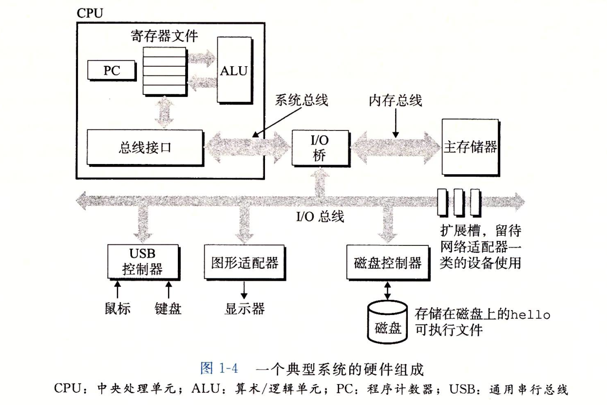

## 1.5 高速缓存至关重要

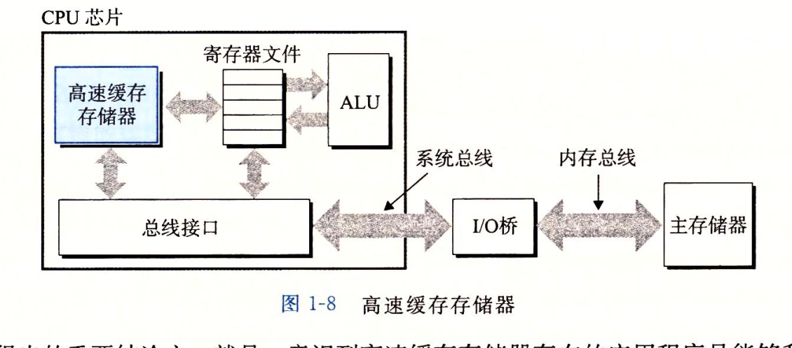

程序运行的过程：
* 从磁盘加载程序到主存
* 从主存加载数据到高速缓存（cache memroy）
* 从高速缓存加载指令到寄存器
* CPU 读取寄存器里的指令和数据做运算

各种存储介质的访问速度：
```text
Latency Comparison Numbers (~2012)
----------------------------------
L1 cache reference                           0.5 ns
Branch mispredict                            5   ns
L2 cache reference                           7   ns                      14x L1 cache
Mutex lock/unlock                           25   ns
Main memory reference                      100   ns                      20x L2 cache, 200x L1 cache
Compress 1K bytes with Zippy             3,000   ns        3 us
Send 1K bytes over 1 Gbps network       10,000   ns       10 us
Read 4K randomly from SSD*             150,000   ns      150 us          ~1GB/sec SSD
Read 1 MB sequentially from memory     250,000   ns      250 us
Round trip within same datacenter      500,000   ns      500 us
Read 1 MB sequentially from SSD*     1,000,000   ns    1,000 us    1 ms  ~1GB/sec SSD, 4X memory
Disk seek                           10,000,000   ns   10,000 us   10 ms  20x datacenter roundtrip
Read 1 MB sequentially from disk    20,000,000   ns   20,000 us   20 ms  80x memory, 20X SSD
Send packet CA->Netherlands->CA    150,000,000   ns  150,000 us  150 ms

Notes
-----
1 ns = 10^-9 seconds
1 us = 10^-6 seconds = 1,000 ns
1 ms = 10^-3 seconds = 1,000 us = 1,000,000 ns
```
利用程序的局部性原理，系统可以有一个很大的主存，同时访问速度也很快。通过高速缓存存放可能经常访问的数据，大部分的访问主存操作都能在高速缓存中完成，从而减少主存访问。


## 1.6 存储设备层次结构
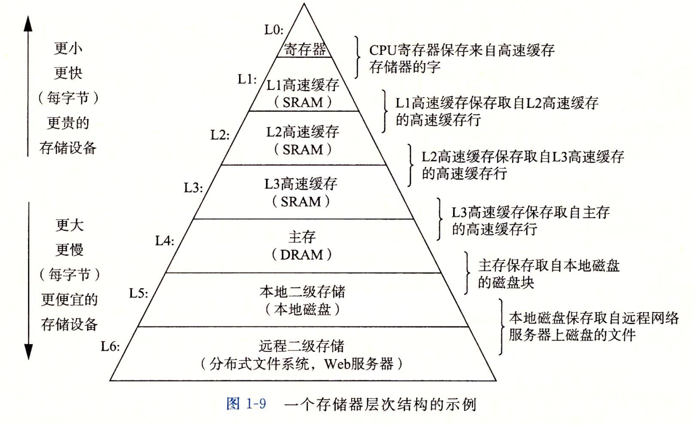

## 1.7 操作系统管理硬件

操作系统在应用程序和硬件设备之间提供了一个统一的抽象层。有两个好处：
* 防止硬件被失控的程序滥用；
* 向应用程序提供简单一致的机制来控制复杂的低价硬件设备；
  
1. 文件是对I/O设备的抽象；
2. 虚拟内存是对主存和磁盘I/O设备的抽象；
3. 进程是对处理器、主存和I/O设备的抽象；

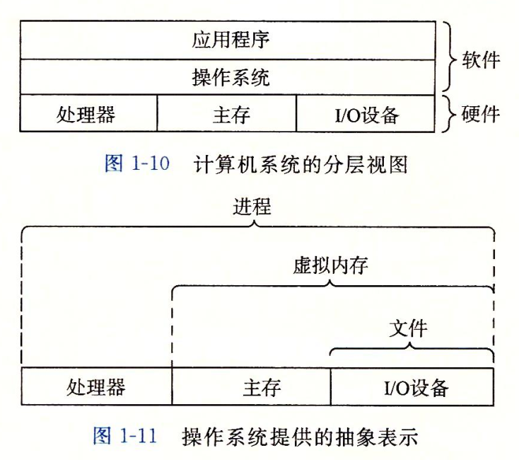

### 1.7.1 进程
进程是是操作系统对正在运行的程序的一种抽象。
在单核和多核系统中，一个 CPU 看上去都像是在并发地执行多个进程，这是通过处理器在进程间切换来实现的。这种交错执行的机制称为**上下文切换**。

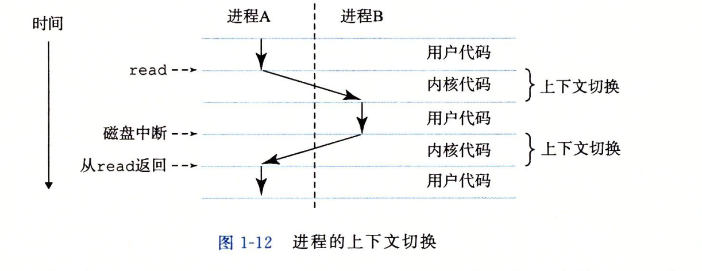

### 1.7.2 线程
线程是进程中的执行单元，每个线程都运行在进程的上下文中，并共享同样的代码和全局数据。

### 1.7.3 虚拟内存
虚拟内存是一种抽象概念，它为每个进程提供了一个假象，即每个进程都独占地使用主存。每个进程看到的内存都是一致的，称为虚拟地址空间。

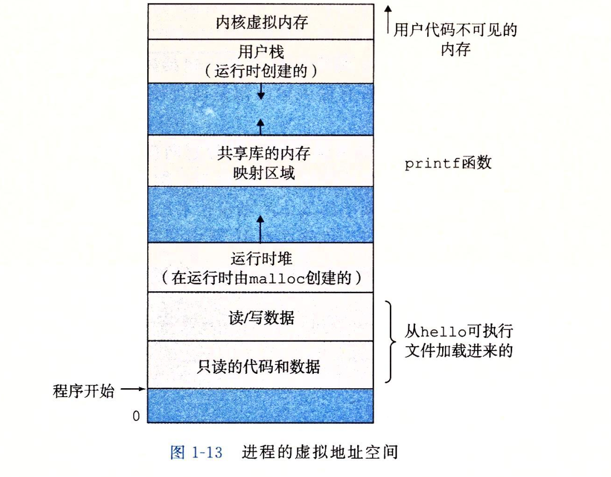

* 程序代码和数据：对所有进程来说，代码是从同一个谷底地址开始，紧接着的是和 C 全局变量相对应的数据位置。
* 堆：代码和数据区后紧跟着的是运行时堆。堆会随着 malloc 和 free 调用动态扩展和收缩。
* 共享库：用来存放 C 标准库和数学库这样的共享库的代码和数据。
* 栈：位于虚拟地址空间的顶部，它存放着函数的参数、局部变量和返回地址。随着调用函数和函数返回扩展和收缩。
* 内核虚拟内存：地址顶部空间区域是为内核保留的。不允许应用程序读写这个区域，只能由内核代码来执行读写操作。


### 1.7.4 文件
文件是操作系统对I/O设备的抽象。是字节序列。每个I/O设备，包括磁盘、显示器、键盘，甚至网络，都可以看成文件。

## 1.8 系统之间利用网络通信

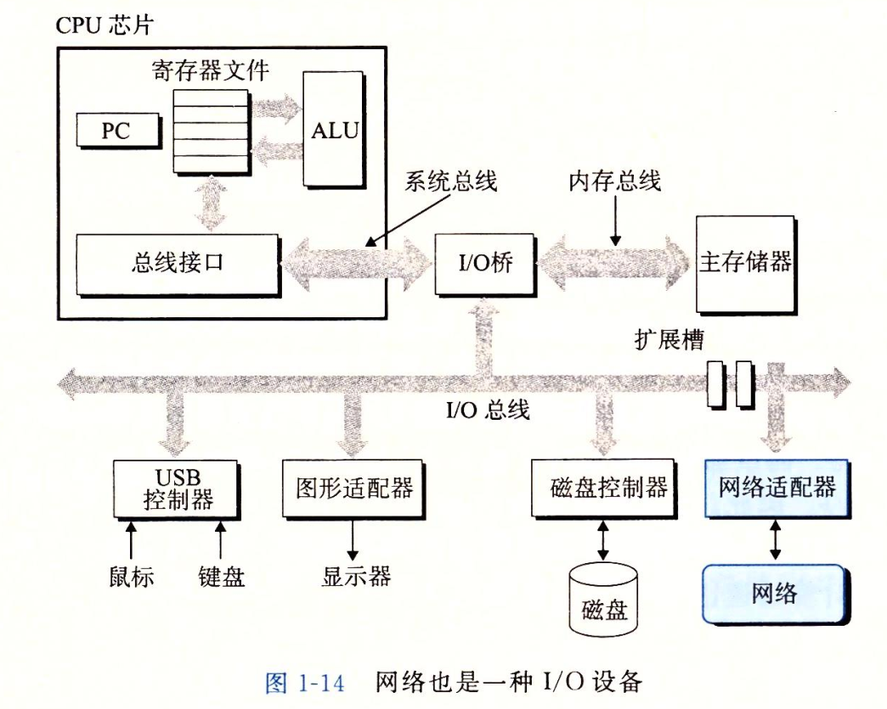


## 1.9 重要主题
### 1.9.1 Amdahl 定律
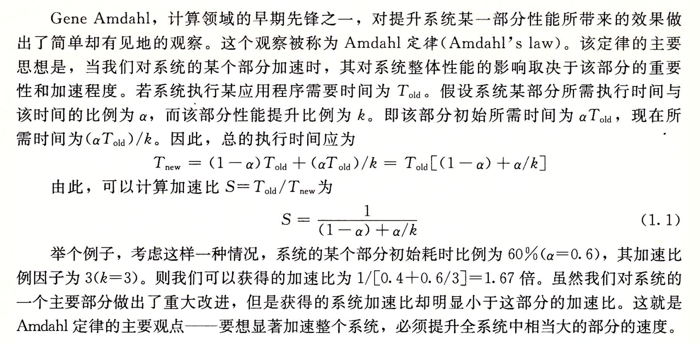


### 1.9.2 并发（concurrency）和并行（parallelism）
1. 线程级并发：
* 单处理器：在一个进程中执行多个控制流。
* 多处理器：每个核都有自己的 L1 和 L2 高速缓存，其中 L1 高速缓存分为两部分，分别保存最近取到的指令和数据；每个核都有自己的寄存器。
* 超线程：又称为同时多线程（simulatenous multithreading），允许一个CPU执行多个控制流；CPU 的某些硬件有多个备份，比如程序计数器和寄存器文件，而其他硬件部分只有一份，比如浮点运算单元。常规处理器需要大约 20000 个时钟周期做线程切换，超线程处理器可以再单个周期的基础上决定执行哪个线程（比如一个线程需要等待数据被加载到高速缓存，那 CPU 可以取执行另一个线程）。

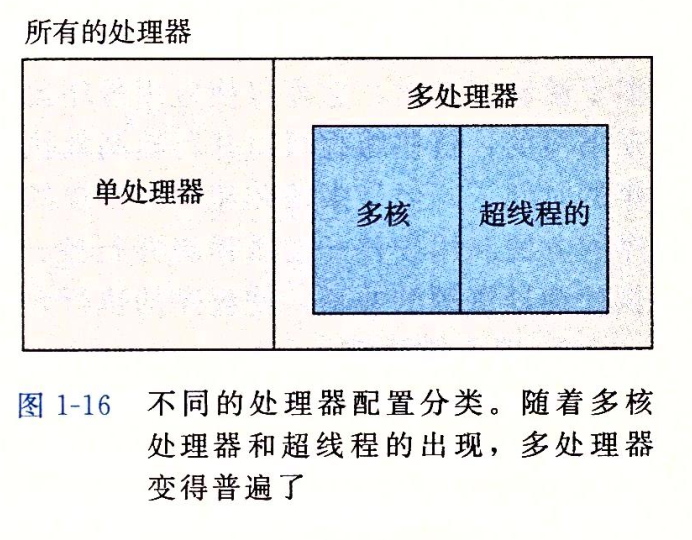

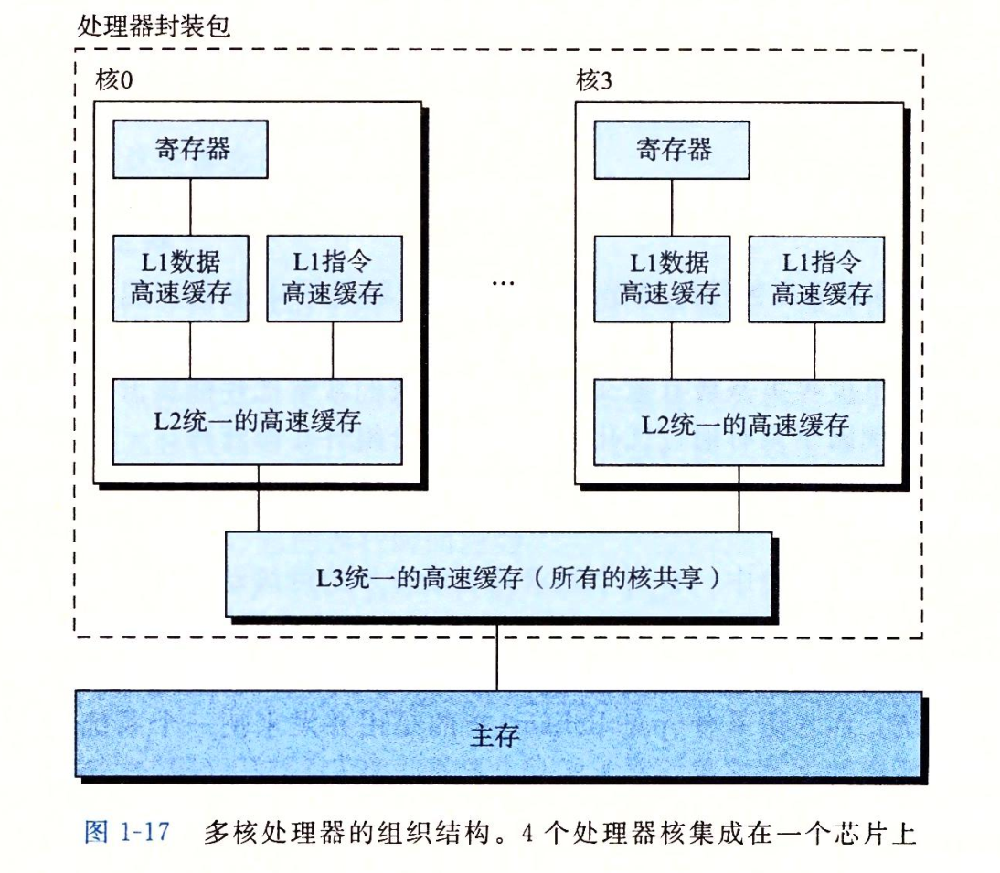

2. 指令级并行：最早的处理器通常需要 3~10 个时钟周期来执行一条指令，而现代处理器可以在每个时钟周期执行 2~4 条指令。这是通过流水线技术实现的。piplelining 将一条指令划分为多个步骤，这些步骤可以并行执行。

3. 单指令、多数据并行：SIMD（single instruction, multiple data）处理器，每个指令可以同时处理多个数据。

### 1.9.3 计算机系统中抽象的重要性
文件是对 I/O 设备的抽象；虚拟内存是对程序存储器的抽象；进程是对正在运行的程序的抽象；虚拟机是对整个计算机系统的抽象；

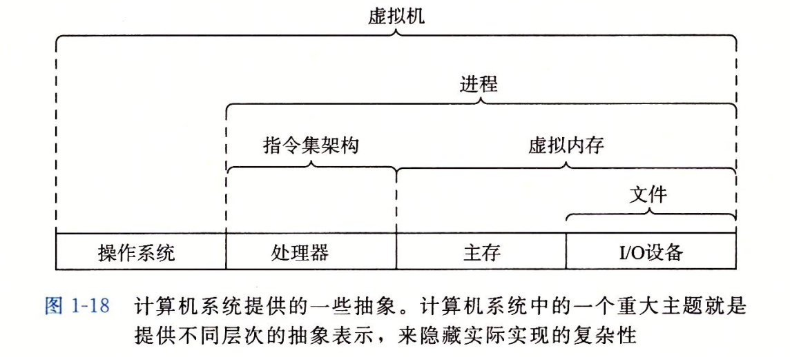
